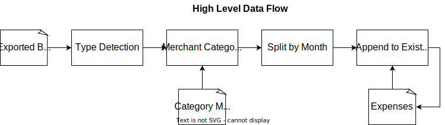

# Budget Helper

## Motivation

Tired of tediously categorizing my past expenses every couple months. Often it's a simple mapping to a category based on where I shop (e.g. Home Depot => House & Living).

## Development

### Dependencies

1. [docker engine](https://docs.docker.com/engine/install/)

### Running

**_Note: You need to be in the root directory of this project (e.g. via `cd budget_helper`)_**

```
CAT_FILE=/path/to/file
IN_FOLDER=/path/to/input_files/
CAT_FILE=$CAT_FILE IN_FOLDER=$IN_FOLDER ./run.sh
```

You can also set the `LOG_LEVEL` env var to one of the
[python logging levels](https://docs.python.org/3/library/logging.html#logging-levels)
as a string, like so: `LOG_LEVEL='DEBUG'`.

### Testing

**_Note: You need to be in the root directory of this project (e.g. via `cd budget_helper`)_**

```
docker build . -t budget_helper
docker run -e LOG_LEVEL='DEBUG' --rm -it budget_helper pytest
```

### Architecture



