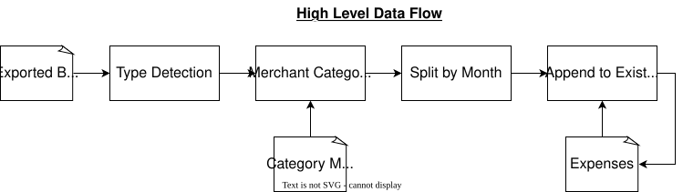

# Budget Helper

## Motivation

Tired of tediously categorizing my past expenses every couple months. Often it's a simple mapping to a category based on where I shop (e.g. Home Depot => Home Improvement).

## Development

### Dependencies

1. [docker engine](https://docs.docker.com/engine/install/)

### Running

**_Note: You need to be in the root directory of this project (e.g. via `cd budget_helper`)_**

```
CAT_FILE=/path/to/file
SOURCE_MAP=/path/to/sources.yml
IN_FOLDER=/path/to/input_files/
CAT_FILE=$CAT_FILE SOURCE_MAP=$SOURCE_MAP IN_FOLDER=$IN_FOLDER ./run.sh
```

You can also set the `LOG_LEVEL` env var to one of the
[python logging levels](https://docs.python.org/3/library/logging.html#logging-levels)
as a string, like so: `LOG_LEVEL='DEBUG'`.

### Merging into an existing workbook

To merge newly categorized transactions into an existing monthly workbook
instead of writing a fresh file, pass `--merge-file`:

```
CAT_FILE=/path/to/file
SOURCE_MAP=/path/to/sources.yml
IN_FOLDER=/path/to/input_files/
CAT_FILE=$CAT_FILE SOURCE_MAP=$SOURCE_MAP IN_FOLDER=$IN_FOLDER \
  ./run.sh --merge-file /path/to/existing.xlsx
```

Only the month sheets (Jan..Dec) are considered, and only the tool columns
(`Source`, `TransactionDate`, `Description`, `Amount`, `BH_Category`) are
modified. Other sheets and other columns within month sheets are preserved.
For each month sheet with new transactions, you are prompted to add all of
them, review them one by one, or skip the sheet. A transaction is considered
already present (and skipped) when its source, date, description, and amount
already exist in the sheet.

### Testing

**_Note: You need to be in the root directory of this project (e.g. via `cd budget_helper`)_**

```
docker build . -t budget_helper
docker run -e LOG_LEVEL='DEBUG' --rm -it budget_helper pytest
```

### Architecture



