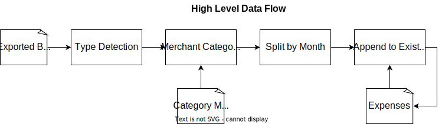

# Budget Helper

## Motivation

Tired of tediously categorizing my past expenses every couple months. Often it's a simple mapping to a category based on where I shop (e.g. Home Depot => House & Living).

## Development

### Dependencies

1. [docker engine](https://docs.docker.com/engine/install/)

### Running

**_Note: You need to be in the root directory of this project (e.g. via `cd budget_helper`)_**

```
docker build . -t budget_helper
docker run --rm -it -v $PWD/output:/usr/src/app/output budget_helper python ./src/budget_helper_bhass1/main.py tests/test-simple/test-categories.yml tests/test-simple/test-amex-credit-simple.csv tests/test-simple/test-chase-credit-simple.csv output/test-simple/out-simple.xlsx
```

### Testing

**_Note: You need to be in the root directory of this project (e.g. via `cd budget_helper`)_**

```
docker build . -t budget_helper
docker run --rm -it budget_helper pytest
```

### Architecture



